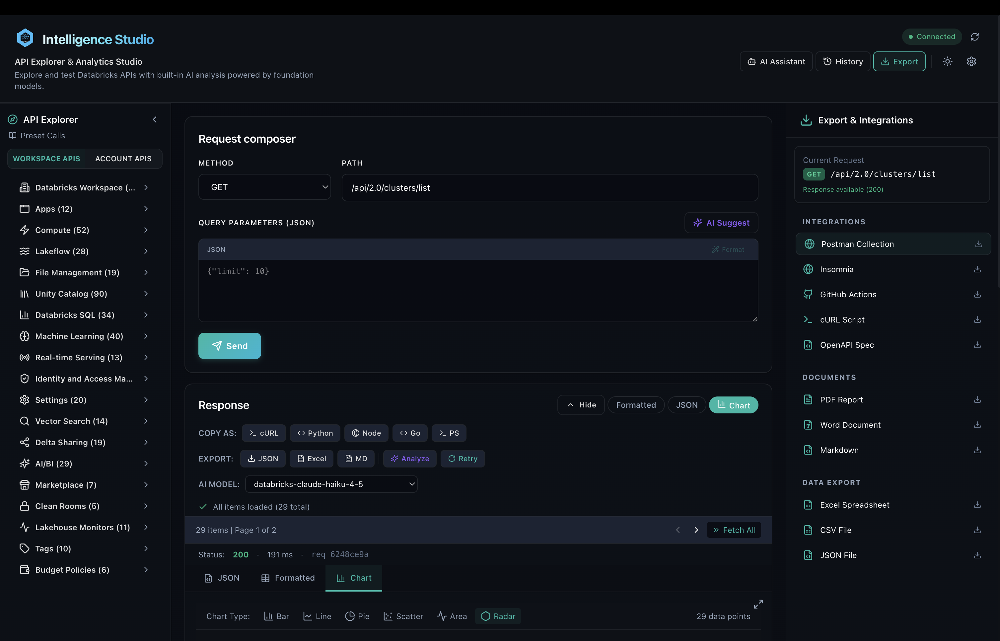
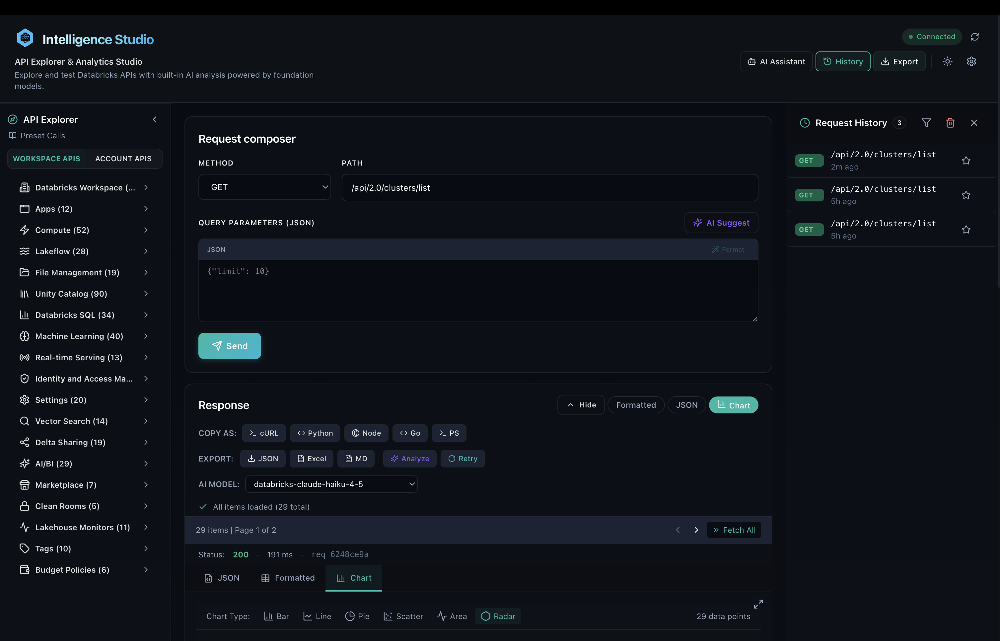
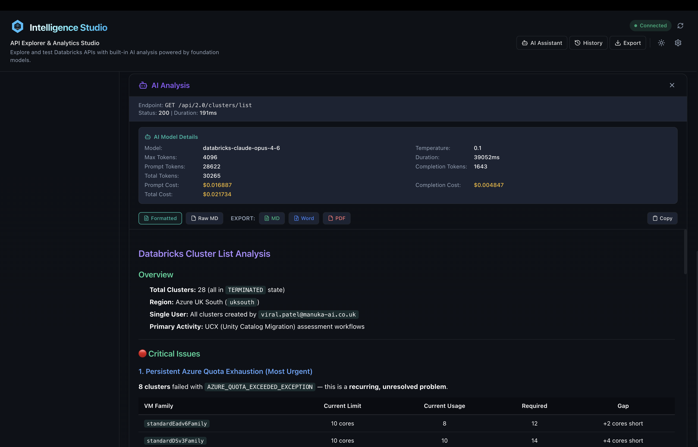
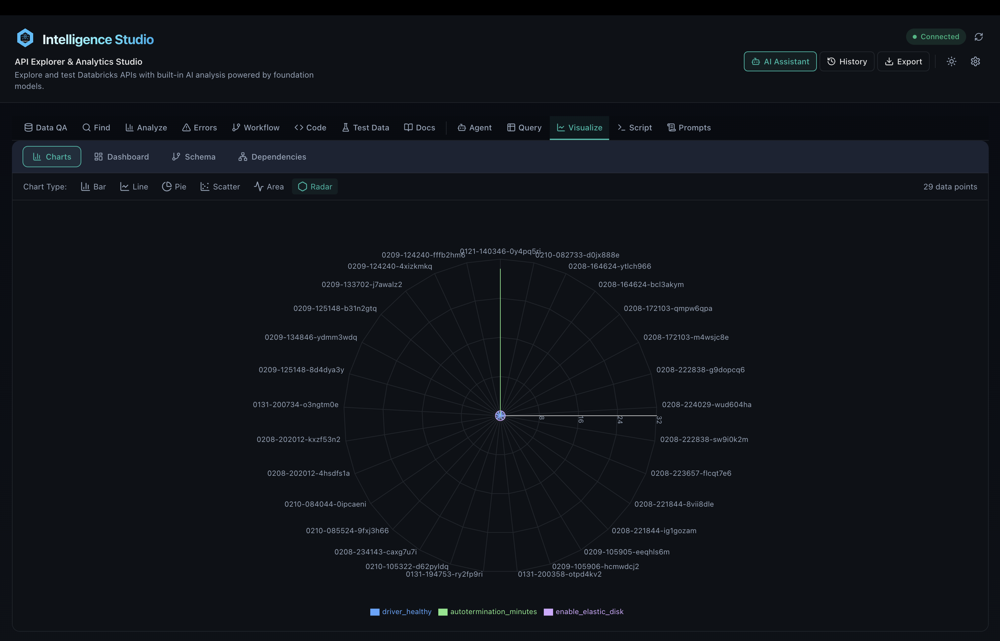
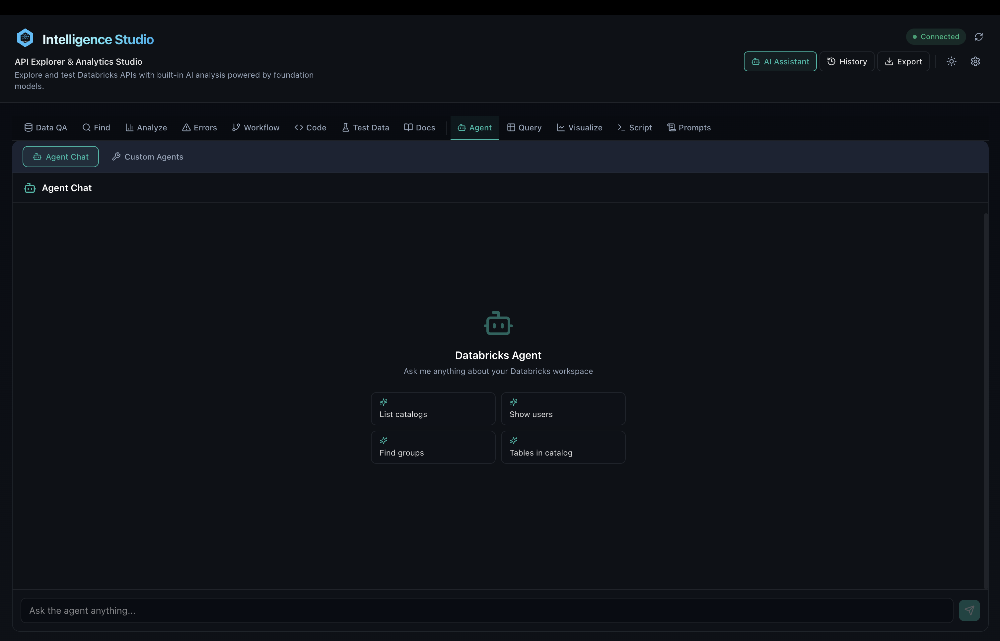
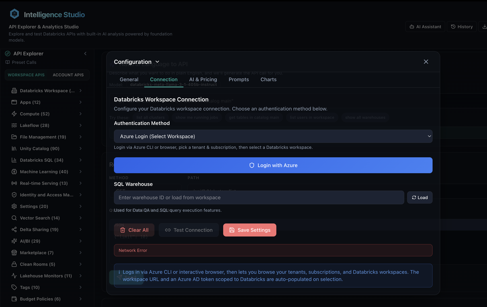
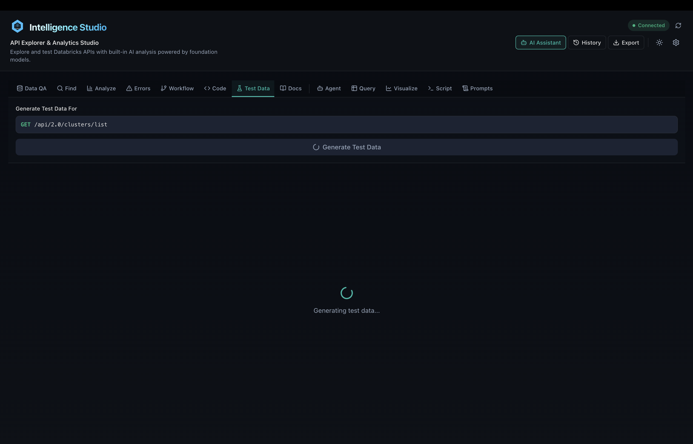

# Intelligence Studio

**AI-powered API explorer for Databricks — browse, test, and analyze 500+ REST APIs in one interface.**




---

## What is Intelligence Studio?

Intelligence Studio is an open-source platform for exploring, testing, and integrating with Databricks REST APIs. It combines a visual API explorer with AI-powered assistance — natural language search, response analysis, code generation, SQL execution, and interactive data visualization.

No more switching between documentation, curl commands, and Postman.

### Key Features

- **500+ API Endpoints** — Complete Databricks REST API catalog organized by service (Compute, Unity Catalog, Jobs, SQL, ML, and more)
- **13 AI Assistant Features** — Data QA, endpoint discovery, response analysis, error diagnosis, code generation, workflow builder, agent chat, and more
- **SQL Query Editor** — Built-in editor with Unity Catalog browser, syntax highlighting, and auto-visualization
- **Data Visualization** — 12 chart types with auto-detection, dashboards, schema visualizer, and dependency graphs
- **Code Generation** — Export working code in Python, cURL, JavaScript, TypeScript, Go, and PowerShell
- **Azure Multi-Workspace Login** — OAuth-based authentication with multi-tenant, multi-subscription support
- **Export Everywhere** — Postman, Insomnia, OpenAPI, GitHub Actions, PDF, Word, Excel, CSV, JSON
- **Request History** — Full replay capability with favorites
- **Cross-Platform** — Web app, macOS desktop, Windows desktop, and Python CLI

---

## Screenshots

| API Explorer | AI Analysis |
|---|---|
|  |  |

| Visualizations | Agent Chat |
|---|---|
|  |  |

| Settings | Test Data |
|---|---|
|  |  |

---

## Getting Started

### Prerequisites

- **Node.js** 18+ and **npm** 9+
- **Python** 3.11+

### Quick Start

```bash
# Clone the repository
git clone https://github.com/viral0216/Intelligence-Studio.git
cd Intelligence-Studio

# Install dependencies
make install

# Start development servers
make dev
```

This starts:
- **Frontend** on http://localhost:5173
- **Backend** on http://localhost:8000

Open [http://localhost:5173](http://localhost:5173) and configure your Databricks host and token in Settings.

### Desktop App

```bash
make build-mac    # macOS (.app)
make build-win    # Windows (.exe)
```

### CLI

```bash
make cli-install
```

---

## Tech Stack

```
Frontend    React 18 + TypeScript + Vite + Zustand + Tailwind CSS 4
Backend     Python + FastAPI + Uvicorn + httpx + Pydantic v2
Desktop     Electron 28
CLI         Python Click + Rich
AI          Databricks Foundation Models (Llama, Claude, Gemma)
```

---

## Project Structure

```
Intelligence-Studio/
  frontend/      React + TypeScript frontend
  backend/       Python FastAPI backend
  desktop/       Electron desktop app
  cli/           Python CLI tool
  scripts/       Build and utility scripts
  docs/          Documentation and demo assets
```

---

## By the Numbers

| Metric | Value |
|--------|-------|
| API endpoints cataloged | 500+ |
| AI assistant features | 13 |
| Code generation languages | 6 |
| Export formats | 10+ |
| Chart types | 12 |
| Feature flags | 14 |
| Customizable AI prompts | 14 |

---

## Security

- Databricks tokens are **never stored** server-side — every request carries its own credentials
- AI-generated scripts are **sandboxed** with blocklist validation before execution
- All request payloads are validated with Pydantic v2 schemas

See [SECURITY.md](SECURITY.md) for details on reporting vulnerabilities.

---

## Contributing

Contributions are welcome! Please read [CONTRIBUTING.md](CONTRIBUTING.md) for setup instructions, coding guidelines, and the PR process.

This project follows the [Contributor Covenant Code of Conduct](CODE_OF_CONDUCT.md).

---

## License

[MIT](LICENSE)

---

> **Note:** This is the first release of Intelligence Studio. You may encounter bugs or rough edges with some AI features. If you find an issue, please [open it on GitHub](https://github.com/viral0216/Intelligence-Studio/issues) — I maintain this project on weekends, so responses may take a few days. Contributions and feedback are always welcome!
