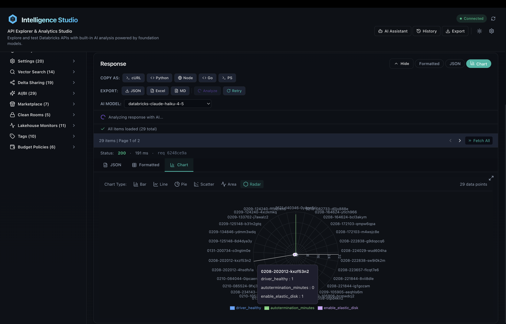
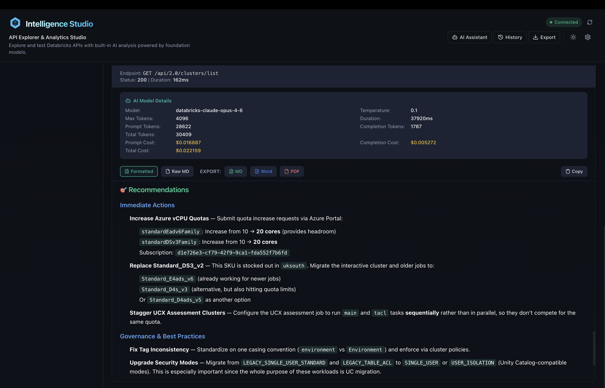
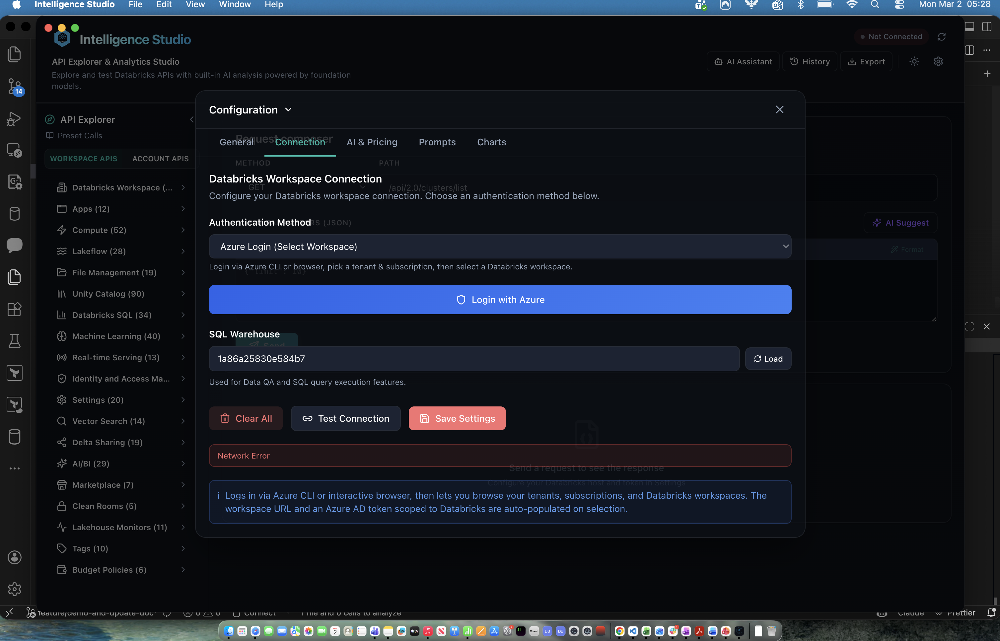
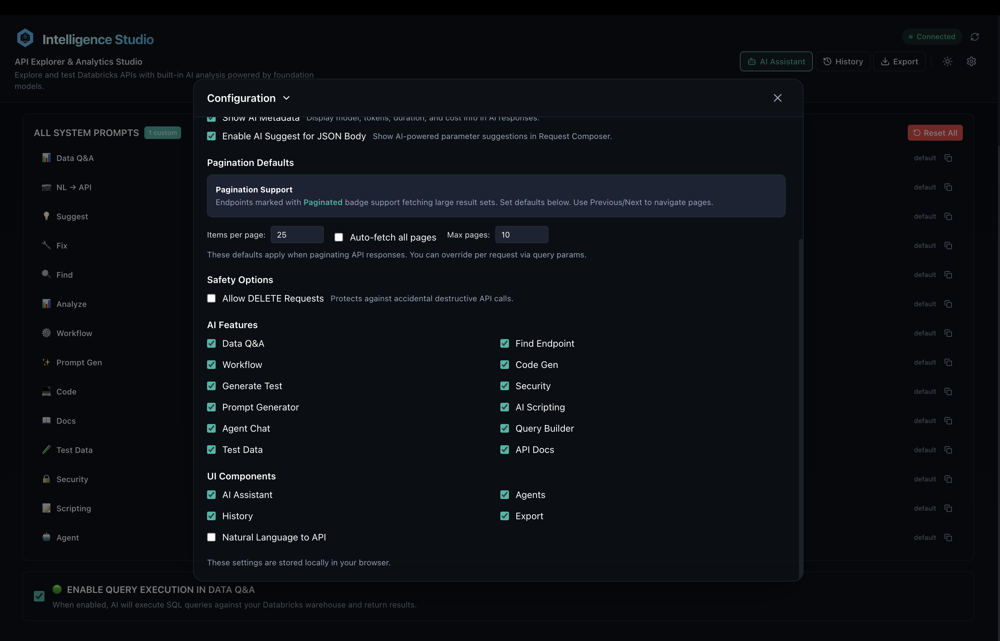

# Introducing Intelligence Studio: An AI-Powered API Explorer for Databricks

*A full-stack platform to explore, test, and analyze 500+ Databricks REST APIs — with built-in AI assistance, SQL execution, data visualization, and multi-workspace Azure login.*

---

If you've ever worked with the Databricks platform, you know the drill: dig through documentation pages to find the right API endpoint, craft curl commands or Postman requests, decode cryptic error messages, and repeat — all before writing a single line of production code.

**Intelligence Studio** changes that. It's an open-source, AI-powered workbench that puts the entire Databricks API surface at your fingertips — with a visual interface, natural language search, and foundation model-powered assistance built right in.


---

## The Problem

Databricks exposes over 500 REST API endpoints across workspaces and accounts. Platform engineers, data engineers, and DevOps teams interact with these APIs daily for tasks like:

- Managing clusters and SQL warehouses
- Configuring Unity Catalog permissions
- Orchestrating jobs and workflows
- Querying Delta tables
- Setting up serving endpoints for ML models

Yet the workflow for testing and debugging these APIs is still fragmented. You're bouncing between browser tabs of documentation, terminal windows with curl commands, and separate tools like Postman — each with its own setup overhead.

## What Intelligence Studio Does

Intelligence Studio is a **full-stack application** (web, desktop, and CLI) that consolidates everything you need for Databricks API work into a single interface.

### 1. API Explorer with 500+ Endpoints

The left sidebar organizes every Databricks REST API into intuitive categories: Compute, Lakeflow, Unity Catalog, Machine Learning, Databricks SQL, and more. Each category expands to show individual endpoints with color-coded HTTP method badges.

Click any endpoint and the Request Composer auto-populates the method, path, and a sample JSON body. Hit **Send** and see formatted results instantly.


### 2. Natural Language to API

Don't know which endpoint you need? Just describe what you want in plain English:

> *"list all clusters"*
> *"show me running jobs"*
> *"get tables in catalog main"*

Intelligence Studio uses Databricks Foundation Models to translate your intent into the correct API call — complete with method, path, and parameters.

### 3. AI Assistant with 13 Specialized Tabs

Toggle the **AI Assistant** button and the interface transforms into a full-width AI workbench with dedicated tools:


| Tab | What It Does |
|-----|-------------|
| **Data QA** | Ask questions about your data in plain English. Get SQL queries generated and executed automatically. |
| **Find** | Describe what you want to do and get the right API endpoint recommended. |
| **Analyze** | Get AI-generated insights from any API response — patterns, anomalies, recommendations. |
| **Errors** | Paste an error response and get root cause analysis with step-by-step fix suggestions. |
| **Workflow** | Build multi-step API workflows where outputs chain into subsequent calls. |
| **Code** | Generate production-ready code from any API call in Python, cURL, JavaScript, TypeScript, Go, or PowerShell. |
| **Test Data** | Generate realistic test payloads for any endpoint. |
| **Docs** | Browse auto-generated API documentation with parameter details and examples. |
| **Agent** | Chat with an AI agent that can call Databricks APIs on your behalf. |
| **Query** | Full SQL query editor with warehouse selection and catalog browser. |
| **Visualize** | Charts, dashboards, schema visualizer, and dependency graphs. |
| **Script** | Describe automation tasks in English and get executable Python scripts. |
| **Prompts** | Customize all 14 system prompts to match your organization's terminology. |

### 4. SQL Query Editor

A built-in SQL editor connected to your Databricks SQL Warehouses. Browse catalogs, schemas, and tables in the sidebar, write queries with syntax highlighting, and view results in a paginated table — or visualize them as charts.



Large result sets exceeding 25MB are handled automatically via external links — no manual pagination needed.

### 5. Data Visualization

Intelligence Studio auto-detects the best chart type for your data and renders interactive visualizations:

- Bar, Line, Pie, Scatter, Area, and Radar charts
- Dashboard builder for multi-chart layouts
- Schema visualizer for table structures
- Dependency graphs for data lineage

### 6. Azure Login with Multi-Workspace Support

For Azure Databricks users, Intelligence Studio supports OAuth-based authentication:

1. Login via Azure CLI or interactive browser
2. Browse your tenants and subscriptions
3. Select a Databricks workspace
4. Token and workspace URL are auto-populated

Switch between workspaces across different subscriptions without manually managing tokens.


### 7. Export Everywhere

Every API interaction can be exported:

- **Code:** Python, cURL, JavaScript, TypeScript, Go, PowerShell
- **Collections:** Postman, Insomnia, OpenAPI Spec
- **CI/CD:** GitHub Actions workflows
- **Documents:** PDF, Word, Markdown, Excel, CSV, JSON

### 8. Request History & Favorites

Every request is saved with full replay capability. Star your frequently-used calls for quick access.


---

## Features & Benefits at a Glance

### AI-Powered Analysis & Recommendations

Every API response can be analyzed instantly. Get pattern detection, anomaly alerts, and actionable recommendations — no manual inspection required.




### Intelligent Agent Chat

Describe what you want in plain English and let the AI agent execute Databricks API calls on your behalf. Pre-built handlers cover common operations like listing catalogs, users, groups, and tables — and you can register custom agents with regex-based routing.


### Interactive Visualizations

Response data is automatically visualized with the best-fit chart type. Build multi-chart dashboards, explore table schemas visually, and trace data lineage through dependency graphs.


### Test Data Generation

Generate realistic, schema-aware test payloads for any endpoint. Speed up development and testing without manually crafting JSON bodies.


### Detailed Settings & Configuration

Fine-tune every aspect of the platform — connection settings, AI model selection, token pricing, feature flags, custom system prompts, and chart preferences — all from a unified settings panel.





---

### Why Intelligence Studio?

| Pain Point | How Intelligence Studio Solves It |
|---|---|
| **Switching between docs, terminal, and Postman** | One interface for browsing, testing, and analyzing 500+ APIs |
| **Memorizing endpoint paths and parameters** | Natural language search — describe what you want, get the right API |
| **Manually writing API client code** | Auto-generate production-ready code in 6 languages |
| **Debugging cryptic API errors** | AI-powered root cause analysis with step-by-step fixes |
| **Building test payloads from scratch** | AI generates realistic, schema-aware test data |
| **Managing tokens across workspaces** | Azure OAuth with multi-tenant, multi-subscription switching |
| **Lack of visibility into API responses** | Auto-detected charts, dashboards, and data lineage graphs |
| **Repetitive multi-step API workflows** | Workflow builder chains API calls with output piping |
| **No cost visibility for AI usage** | Built-in token tracking and cost estimation per request |
| **One-size-fits-all AI prompts** | 14 fully customizable system prompts to match your org's needs |

### Key Highlights

- **Cross-Platform** — Runs as a web app, macOS desktop app, Windows desktop app, or Python CLI
- **Secure by Design** — Tokens are never stored server-side; every request carries its own credentials
- **Sandboxed Scripting** — AI-generated Python scripts run in a protected environment with blocklist validation
- **Enterprise-Ready** — 14 feature flags, custom prompts, cost tracking, and role-appropriate views
- **Extensible** — Register custom AI agents, add new chart types, and customize export formats
- **Open Source** — Full source code available for inspection, extension, and self-hosting

---

## Architecture

Intelligence Studio is built as a modern full-stack application:

```
Frontend:  React 18 + TypeScript + Vite + Zustand + Tailwind CSS 4
Backend:   FastAPI + Uvicorn + httpx + Pydantic v2
Desktop:   Electron 28
CLI:       Python Click + Rich
AI:        Databricks Foundation Models (Llama, Claude, etc.)
```

The backend acts as a secure proxy — your Databricks tokens are never stored server-side. Each request carries its own credentials, and generated scripts are validated against dangerous patterns before execution.

### Key Numbers

| Metric | Value |
|--------|-------|
| API endpoints cataloged | 500+ |
| AI features | 13 |
| Code generation languages | 6 |
| Export formats | 10+ |
| Backend API endpoints | 48 |
| Feature flags | 14 |
| Customizable AI prompts | 14 |
| Chart types | 12 |

---

## Who Is This For?

**Platform Engineers & Admins** — Browse and test APIs without curl. Manage clusters, warehouses, users, and Unity Catalog from one interface.

**Data Engineers & Analysts** — Ask questions in English, get SQL. Execute queries, visualize results, explore catalogs.

**Developers & DevOps** — Generate code in 6 languages. Export to Postman, GitHub Actions, OpenAPI. Build automation scripts with AI.

**Security & Governance Teams** — Get AI-powered security analysis per endpoint. Export audit-ready documentation.

---

## Getting Started

```bash
# Clone and install
git clone <repo-url>
cd Intelligence-Studio
make install

# Start everything
make dev

# Or run individually
make dev-backend   # FastAPI on :8000
make dev-frontend  # Vite on :5173
```

Configure your Databricks host and token in the Settings modal, or use Azure Login for OAuth-based authentication.

### Desktop App

Intelligence Studio also ships as a native desktop app for macOS and Windows:

```bash
make build-mac    # Build .app for macOS
make build-win    # Build .exe installer for Windows
```

---

## What's Next

Intelligence Studio is under active development. Upcoming features include:

- **Multi-cloud authentication** — AWS and GCP workspace support alongside Azure
- **Collaborative workspaces** — Share saved requests and workflows with your team
- **Custom agent builder** — Define AI agents with custom tools and behaviors
- **Notebook integration** — Export workflows directly as Databricks notebooks

---

## Try It

Intelligence Studio is open source and ready to use. Whether you're managing a single workspace or dozens across Azure subscriptions, it aims to make Databricks API work faster, more visual, and more accessible.

Give it a spin, and if you find it useful, contributions and feedback are welcome.

---

*Intelligence Studio is an independent open-source project. 
